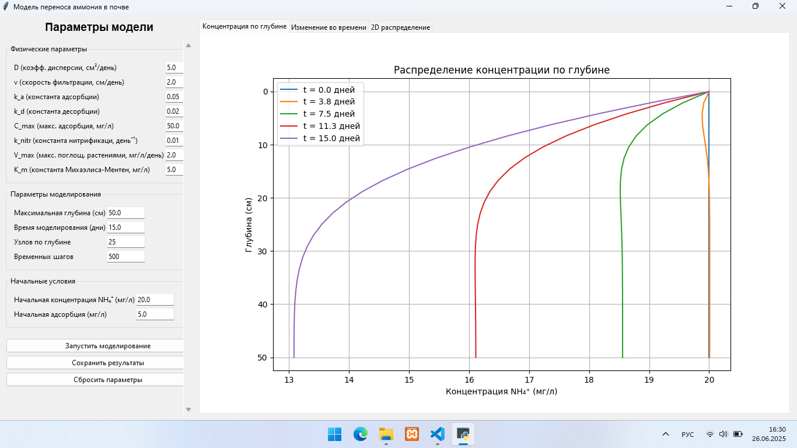

# Ammonium Simulator

Программа моделирует поведение аммония (NH₄⁺) в почве с учётом:

- адсорбции/десорбции,
- нитрификации,
- фильтрации и поглощения растениями.

## Интерфейс

Главное окно:



График результатов:

.png)
.png)


## Запуск

```bash
python main.py
````

## Зависимости

Install libraries:

```bash
pip install -r requirements.txt
```

